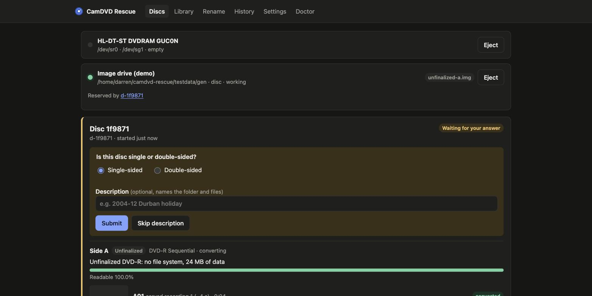
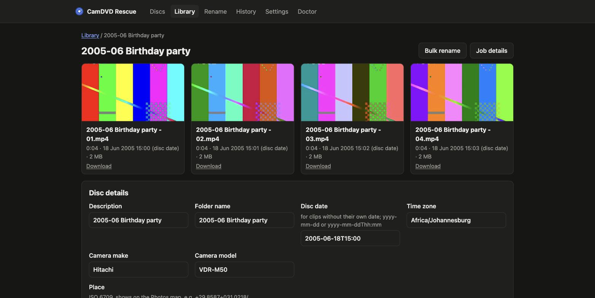
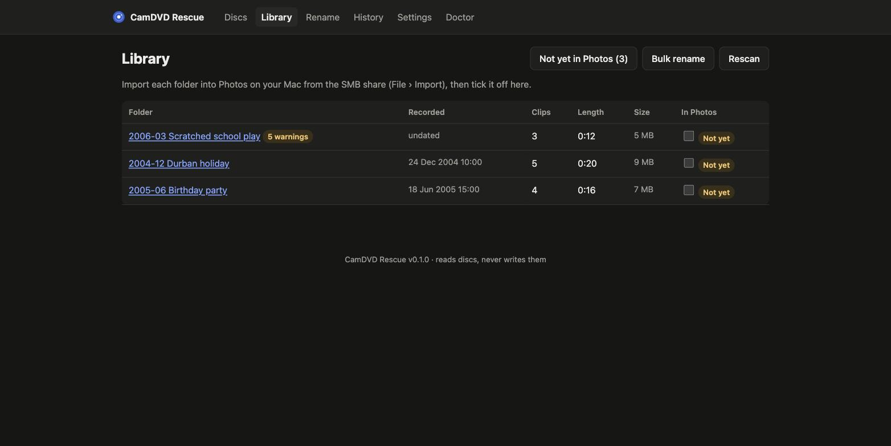
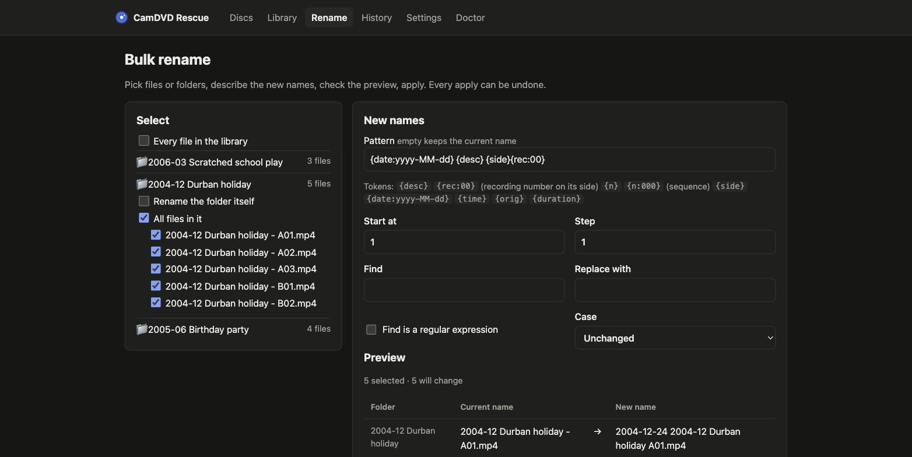

# CamDVD Rescue

[](https://github.com/dnaidoo621/camdvd-rescue/actions/workflows/ci.yml)
[](https://scorecard.dev/viewer/?uri=github.com/dnaidoo621/camdvd-rescue)
[](https://github.com/dnaidoo621/camdvd-rescue/releases/latest)

Turns a stack of 8 cm camcorder DVDs into folders of MP4s that land in iCloud
Photos on the right date, with one disc insert and two optional answers per
disc. It runs on a Linux x64 machine with a DVD drive and is driven from any
browser on the network.

- Recovers finalized DVD-R (DVD-Video), DVD-RW/DVD-RAM (DVD-VR) and
  **unfinalized** DVD-R discs, without the original camcorder.
- Asks only what the machine can't know: single or double-sided, and an
  optional description. Imaging starts the moment a disc is detected.
- MP4 (H.264 + AAC, deinterlaced to 50p/59.94p) with Apple Photos date,
  camera and place tags; the untouched source is kept.
- Bulk rename with live preview, conflict checks and one-click undo.
- Reads discs, never writes them.

| The two questions, asked while side A is read | A finished disc, dated and tagged for Photos |
| --- | --- |
|  |  |
| **Library**, with what's still to import into Photos | **Bulk rename** with live preview and undo |
|  |  |

> **Status: v0.1** — every pipeline path is tested against synthetic disc
> images, and install/update/rollback on real hardware, but not yet against
> real camcorder discs. See [docs/m0-decisions.md](docs/m0-decisions.md).

## Install

On Debian 12+ or Ubuntu 22.04+ (x64, systemd):

```sh
curl -fsSL https://github.com/dnaidoo621/camdvd-rescue/releases/latest/download/install.sh | sudo bash
```

It installs the distro tools, puts the app and a pinned FFmpeg in
`/opt/camdvd`, creates the unprivileged `camdvd` user, asks for the library
folder, port and whether other machines connect, stops the desktop from
automounting the drive, starts `camdvd.service` and runs the self-check.

Then open `http://<server>:8780`. To require a login, set
`CAMDVD_PASSWORD=…` in `/etc/camdvd/env` and `sudo systemctl restart camdvd`.

```sh
sudo camdvd update        # newer release (backs up the database first)
sudo camdvd rollback      # back to the previous release and database
sudo camdvd uninstall     # removes the app; never touches the library
journalctl -u camdvd -f   # logs
camdvd doctor             # dependency and device self-check
```

## Using it

1. Insert a disc. The card that appears in every open browser asks single or
   double-sided and an optional description such as "2004-12 Durban holiday".
2. Double-sided: when side A is read the tray opens; flip the disc and insert
   side B. Inserting side A again is detected.
3. Each recording becomes `<description> - A01.mp4` and so on in one folder
   per disc. Working files (image, sources, manifest) stay in
   `<library>/.camdvd/<disc-id>/`, so importing a folder into Photos brings in
   only the MP4s.
4. In **Library**, fix a disc's date, time zone, camera or place (tags are
   rewritten without re-encoding), preview clips, and tick folders off once
   they're imported into Photos (File › Import from the SMB share).

Unfinalized discs and DVD-Video discs don't store per-recording dates; set a
disc date in the library and clips are spaced one minute apart in recording
order. DVD-VR (DVD-RAM/RW) discs keep each recording's date and time.

Headless, for one disc:

```sh
camdvd rip -device /dev/sr0 -sides 2 -desc "2004-12 Durban holiday" -out /srv/camdvd/library
camdvd carve side-A.img -out carved/     # raw recovery from an image
```

## Development

```sh
scripts/make-test-images.sh            # synthetic finalized, unfinalized, damaged, data and blank images
CAMDVD_BIN=/path/to/ffmpeg/bin go test ./...
go run ./cmd/camdvd serve -config dev.toml -demo testdata/gen   # adds an image "drive"
scripts/build-release.sh 1.0.0         # release bundle in dist/
```

`CAMDVD_HOST=user@box scripts/remote.sh <cmd>` syncs the tree to a Linux
test box and runs a command there.

## Documentation

- [User guide](docs/user-guide.md): install, ripping, the library, dates and
  iCloud, bulk rename, settings, troubleshooting
- [Architecture](docs/architecture.md): packages, state machine, imaging,
  carving, files on disk, security
- [HTTP API](docs/api.md)
- [Spec and implementation plan](docs/spec.md)
- [M0 decision table](docs/m0-decisions.md): what's settled and what needs
  real discs
- [Changelog](CHANGELOG.md) · [Third-party software](THIRD_PARTY.md)
- [Contributing](CONTRIBUTING.md) · [Security policy](SECURITY.md) · [Code of conduct](CODE_OF_CONDUCT.md)

## Licence

MIT. The bundled FFmpeg and dvd-vr are separate GPL programs; see
[THIRD_PARTY.md](THIRD_PARTY.md).
